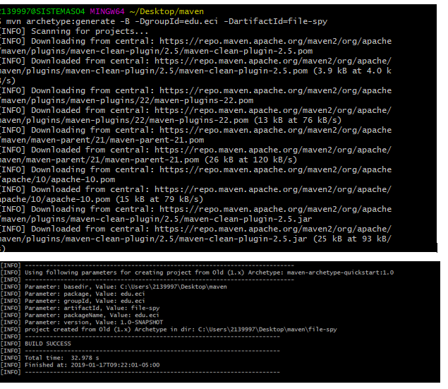

# file-spy

## creating the project 

## What do means the -B option in the command?
the -B option means that the project will be created in batch-mode.\
this means that the project will be created with the default values for the release version instead of asking for them.

## What do means the -D option in the command?
the -D option refer to a system property of the project, each property is preceded by the -D, 
for example to specify the groupId we will write the -DgroupId command.
acording to MAVEN: "The groupId, artifactId, version and package are the main properties to be set" (https://maven.apache.org/archetype/maven-archetype-plugin/examples/generate-batch.html)
this means that every project must have this properties defined.
## What do means the groupId, artifactId properties in the command?
the groupId identifies the project among the other projects created with maven, this means that each project has a diferent groupId
this means that the groupId must follow the naming convention of java, for example: org.apache.maven or org.apache.commons.
where maven and commons are diferent projects with an unique groupId.

