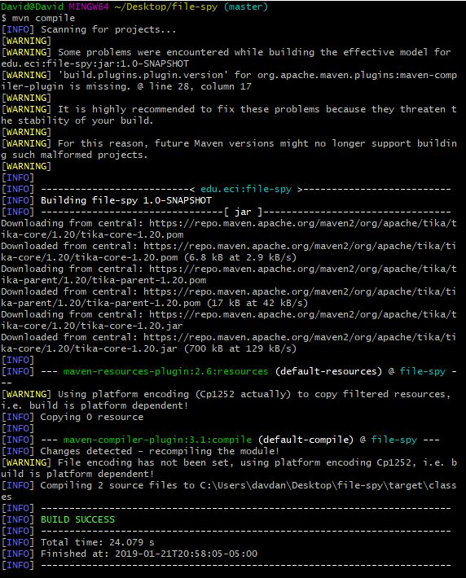

# file-spy

## creating the project 

## What do means the -B option in the command?
the -B option means that the project will be created in batch-mode.\
this means that the project will be created with the default values for the release version instead of asking for them.

## What do means the -D option in the command?
the -D option refer to a system property of the project, each property is preceded by the -D, 
for example to specify the groupId we will write the -DgroupId command.
acording to MAVEN: "The groupId, artifactId, version and package are the main properties to be set" (https://maven.apache.org/archetype/maven-archetype-plugin/examples/generate-batch.html)
this means that every project must have this properties defined.
## What do means the groupId, artifactId properties in the command?
the groupId identifies the project among the other projects created with maven, this means that each project has a diferent groupId
this means that the groupId must follow the naming convention of java, for example: 
  -org.apache.maven  
  -org.apache.commons. 
where maven and commons are diferent projects with an unique groupId. 

on the other hand the artifactId refers to the name we want to give to the project (if we created it) and the name it will be displayed at the .jar file.
## Describe the content of the directory that has been created.
the directory contains a src folder and a pom.xml file, the src file contains the main and test folders,each folder contains the route java/edu/eci/ and finally the files App.java and AppTest.java respectively.

## What do means the word SNAPSHOT in the version value?
the SNAPSHOT tag means that the project is still under development and should not be released yet, when we want to release the project we 
should remove the SNAPSHOT tag and specify the version we are want to deploy.

## What is the purpose of the packing tag into the POM file?
the packaging tag specifies the way maven will package the project when we run it, if the packaging tag is missing maven will set it .jar as default, acording to maven the current core packaging values are: pom, jar, maven-plugin, ejb, war, ear and rar.
## What is the purpose of the dependencies and dependency tags into the POM file?
the purpose of the dependencies and dependency tags is to add certain tools and frameworks to the project in order to use them,these frameworks are hold on the maven repository(https://mvnrepository.com/) and acording to what we need we search them and add the dependency tag 
on the POM file. when we are done we close the dependencies tags in order to specify that no other dependency is needed.

## The three principal Maven lifecycles are clean, default and site. Describe each one.
The default lifecycle handles your project deployment, the clean lifecycle handles project cleaning, while the site lifecycle handles the creation of your project's site documentation.(https://maven.apache.org/guides/introduction/introduction-to-the-lifecycle.html)

## Using the terminal execute the command mvn compile. Take the output screenshot. What is this command using for? What are transitive dependencies?

as we can see the compile command compiles the entire project and check that everything is ok and every file compiles, when everything compiles it shows the build success message.
## Using the terminal execute the command mvn package. Take the output screenshot. What is this command using for?

the package command goes one step further of the compile command, when we use the package command it executes the compile command and also try the test files to check that the application is doing what it is suposed to do, when everything is working correctly it shows the build success message.
## Using the terminal execute the command mvn install. Take the output screenshot. What is this command using for?

finally the install command applies the package command and when everything is ok it create the packaging file we specify beforfe on the pom.xml file, in this case a .jar file.
